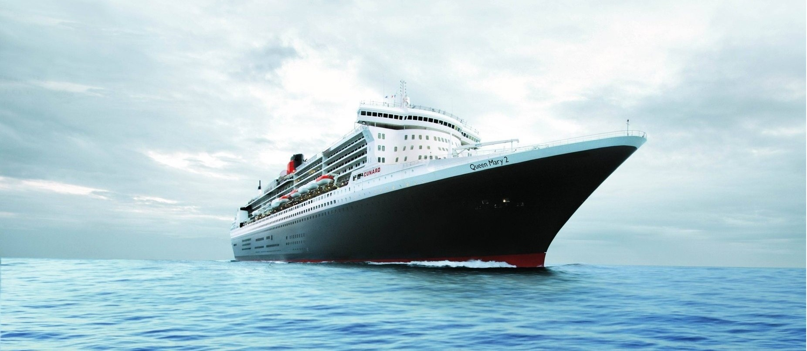
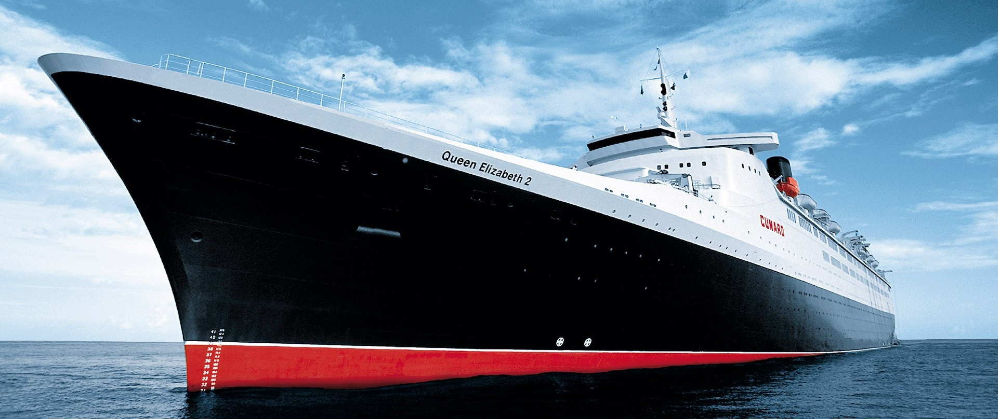

            
            

                <button class="btn btn-success">Contact</button>
            

        

.ship {
    max-width: auto;
    height: auto;
}
body {
    background-image: url('images/ship-image-5.jpg');
}
bg-success
.about {
    padding-bottom: 13%;
}

 

        
        

            <h4 class="card-title">Our Services</h4>
            
 At miles shipping We offer all kinds of shipping services 
            
            

            <a href="#" class="btn btn-primary">Get Started</a>
        

    

    .card-img-top {
    height: 10%;
}

<form class="pt-3 form">
        

            

                <input type="text" class="form-control" placeholder="First Name">
            

            

                <input type="text" class="form-control" placeholder="Last Name">
            

            

                <input type="email" class="form-control" placeholder="Enter Email">
                <small class="form-text">We will never share your email with another person</small>
            

        

    </form>

    

            

                <input type="text" class="form-control" placeholder="First Name" id="firstname">
            

            

                <input type="text" class="form-control" placeholder="Last Name" id="lastname">
            

            

       

           
           

               <h5 class="card-title">Our Services</h5>
               
Lorem ipsum dolor sit amet consectetur adipisicing elit. 
                   Placeat fugiat sequi, eum repellendus incidunt laudantium 
                   cupiditate earum rerum dolore dolorum recusandae, itaque amet nihil alias. 
                   Temporibus consectetur corporis doloremque optio.

           

           

               <small class="text-muted"> Footer </small>
           

            

                
Miles Shipping

            

            <small class="sub-heading">Tested & Trusted!</small>

            

                <button action="contact.html" class="btn btn-md overlay text-white btn-1">GET STARTED</button>
            

            .img-overlay {
    position: absolute;
    top: 20%;
    bottom: 0;
    left: 0;
    right: 0;
    text-align: center;
}

.img-overlay:before {
    content: ' ';
    display: block;
    /* adjust 'height' to position overlay content vertically */
    height: 50%;
}

.overlay {
    background-color: teal;
}

.overlay:hover {
    color: black;
}